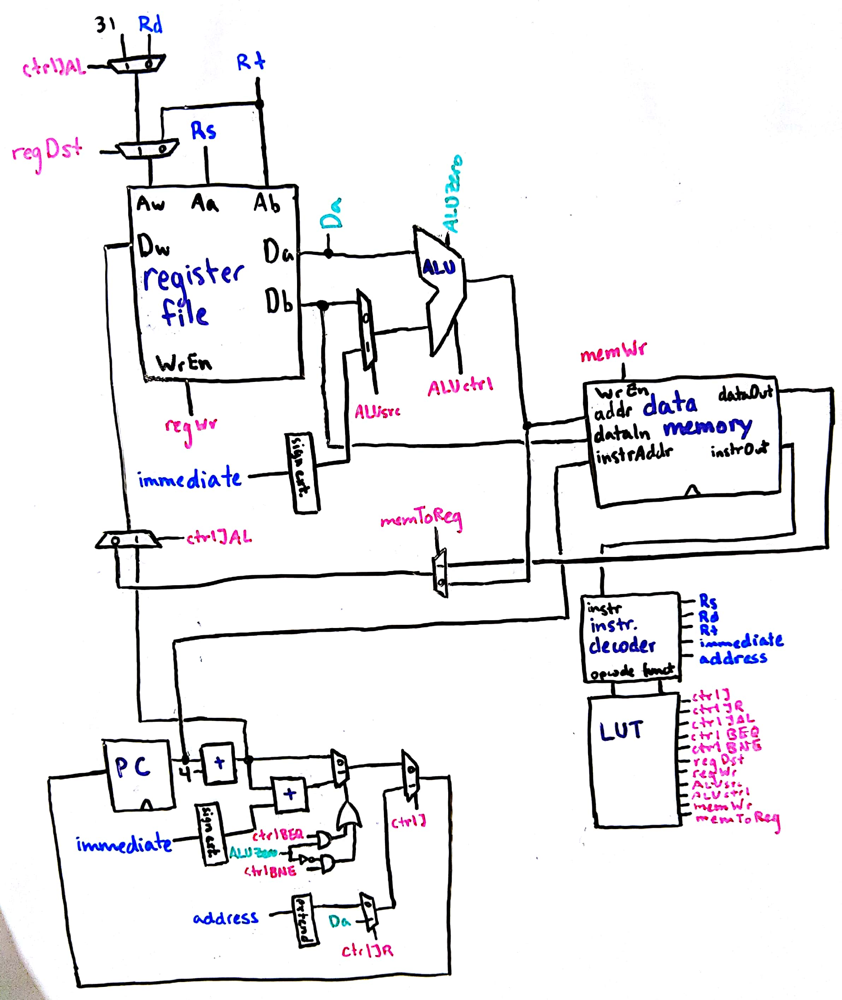

# Nice Try Lab 3 Report
Louise Nielsen and Camille Xue

## CPU Architecture

Our CPU has several larger components: a register file, an ALU, data memory, program counter, instruction decoder, and a lookup table. The register file, ALU, basis for the data memory, and syntax for the lookup table are from our past labs and homework.

The addition to the data memory is translating from the MIPS array addresses to a Verilog array address.

The lookup table is described [here](https://docs.google.com/spreadsheets/d/1HFBnwofPQbGYB8HaPXBAwar5IqTbcpSo8ErthNMP9HU/edit?usp=sharing).

The instruction decoder takes in an instruction and outputs all of the different parts of the instruction we might want, basically by assigning parts of the instruction to outputs. The opcode and funct outputs go to the lookup table.

The program counter is a D flip flop that adds four to itself, muxes with the branch address (in case of branching), muxes with the jump address (in case of jumping), and then sets itself (usually to its previous state plus four). Its current state is always the instruction address for data memory.

## Test plan
After making the submodules for the cpu and doing unit tests for most of them, we created a verilog testbench for our single cycle cpu that would load an assembly file into the datamemory and excute the program. After our inital test, we found that our cpu seemed to be working partially, and saw that several of our modules were actual still being clocked, like our ALU and our cpu control LUT. After eliminating that, we discovered that our PC unit wasn't incrementing properly and our CPU could only successfully complete the first instruction. We also found that our datamemory wasn't indexing properly, since we where not dividing the MIPS PC by 4, which would actually give the Verilog array index. After fixing these issues, we were able to start testing the functionality of each instruction using more complex assembly tests.

We created an [assembly test](mem.asm) which tests all required functionality (except JR and JAL). Using this test, we discovered that our SLT wasn't working because our ALU was partly incorrect. We also used the provided `array_loop.asm` and `fib_func.asm` tests from the in-class repo. To test these, we looked at the values of relevant wires in gtkwave and made sure they matched what we expected.

## Performance/area analysis of design
One of the most area expensive parts of our CPU is the CPU control signal LUT because it has essentially 12 input bits, 6 for the `opcode` and 6 for the `funct` of the instruction. A 4-input LUT uses 15 muxes, a 7-input would use something like 135 muxes by using eight 4-input muxes and 7 muxes after that. So to have 12 inputs, we would need well over 200 muxes just to implement our control signal LUT. Or alternatively, we could have two separate 6-input LUT since the 6 instructions that are determined by their funct have the same opcode value. This would reduce the size of our LUT, since you'd only need one additional mux to determine which of the two LUT should be used to determine the control signals. For example, if the `opcode` is just `000000`, then the control signals are actually determined by the `funct` value, which tells what the specific instruction is. If it's not, then the `opcode` determines the control signals directly.

## Work plan reflection

We actually pretty much stuck to the plan for Week 1. Week 2 fell apart and we did almost nothing (especially the second half). This was partly due to doing the midterm at the last possible moment, kind of waiting for Carl, and mental health issues. We managed to do most of the work of Week 2 six days after it was expected. Our time was generally accurate, except that we spent less time implementing diagram and more time debugging. We didn't anticipate the time required to figure out assembly testing and how that works with verilog. We learned that making time to work near instructors helps counterbalance the mental health issues because it adds accountability and structure to our process. We also learned that it's hard to tell when you should just give up on a teammate doing the work with you or not.
